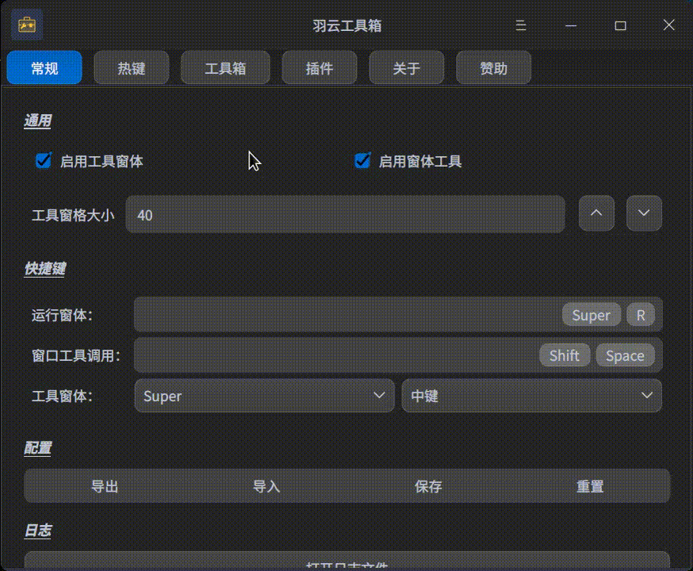

<h1 align="center"> WingSummer.WingTool</h1>

羽云工具箱

- 开源不易，给个 Star 或者 [捐助](#捐助) 吧

## WingTool

&emsp;&emsp;`WingTool`是一个强大的插件工具箱，中文名`羽云工具箱`，支持热键响应、鼠标跟踪、选词等相关借口。通过开发强大的对应的插件，就可以大大提高生产力。
&emsp;&emsp;该软件如果没有任何插件，仅支持添加热键使用默认方式打开任何文件。插件的强大决定着该软件的上限，通过热键可以配置使用热键调用插件借口；默认通过鼠标中键配合`Ctrl`键可以调出工具窗口，选择合适的工具；也可以通过热键调出窗口工具，点击打开所需的文件或者软件，而不必从启动器翻找，避免任务栏图标过多以及桌面文件过多的情况。

## TODO

&emsp;&emsp;现在工具处于开发状态，很多功能并没有完成：

1. 配置相关（已完成 80%）
2. 窗口工具（已完成 10%）
3. 语言本地化（已完成 0%）
4. 软件 UI 相关（已完成 90%）

&emsp;&emsp;如下是已完成的功能：

1. 插件系统的设计
2. 热键调用功能
3. 工具窗口

&emsp;&emsp;待功能基本完成的时候，我会同步到我使用的所有代码托管平台。

### 协议

&emsp;&emsp;本软件如果是开源版本将遵循`AGPL-3.0`协议，请勿用于该协议之外的用途。如果你想将本软件的代码用于闭源的商业代码，想要解除`GPL`系列的必须开源的限制，请必须亲自咨询我，商讨商业授权相关事宜。

## 有关 issue

&emsp;&emsp;本软件定位是本地生产力基础工具，旨在快速启动和使用高效工具。本人不考虑像 utool 和 quicker 之类提供插件商店。该程序不会进行与网络相关的任何操作，所有的插件安装都是本地的。如果有仅本地的需要，待该软件出 beta 之后，可以尝试该软件，发现 Bug 并递交修复。

## 效果图

&emsp;&emsp;还没做完，就不放效果图了……

&emsp;&emsp;还是放个草图吧，以免有人惦记：

## 捐助

**
您的每一份支持都将是本项目推进的强大动力，十分感谢您的支持
**

感谢支持

感谢支持

